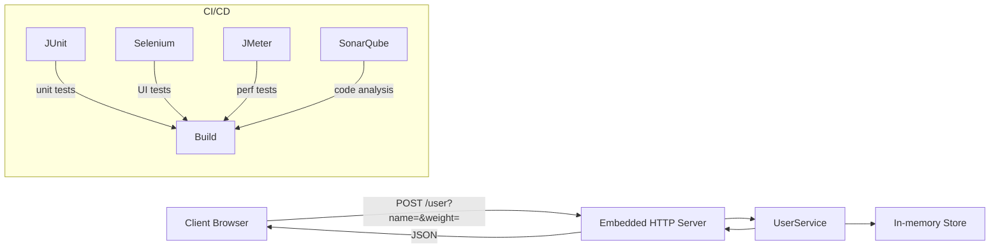

# HealthTrack-App
[](https://openjdk.org/projects/jdk/17/)
[](https://maven.apache.org/)
[](https://docs.docker.com/compose/)
[](https://junit.org/junit5/)
[](https://jmeter.apache.org/)
[](https://www.selenium.dev/)
[](https://www.google.com/chrome/)
[](https://www.sonarqube.org/)


## 📋 Overview

**HealthTrack-App** is a simple Java web application for tracking user weight.
It exposes a REST endpoint to update and retrieve user weight, stores it in-memory, and serves a minimal HTML interface.

This repository includes:

1. **Bug fix** in `User.updateWeight(double)`
2. A **main()** to launch an embedded HTTP server
3. **Automated tests**:

    * Unit tests (JUnit 5)
    * UI tests (Selenium + headless Chromium)
    * Performance tests (JMeter)
4. A **Dockerfile** + **docker-compose.yml** to run the app + JMeter in a network
5. A **GitHub Actions CI pipeline** (`.github/workflows/ci.yml`)
6. **SonarQube analysis** integrated in CI for code quality.

## 🛠️ Technologies Used

| Tool               | Version | Purpose                          |
| ------------------ | ------- | -------------------------------- |
| ☕ Java             | 17      | Main programming language        |
| 📦 Maven           | 3.8+    | Build and dependency manager     |
| 🧪 JUnit 5         | 5.10    | Unit testing framework           |
| 🎭 Mockito         | 5.12    | Mocking framework for tests      |
| 🧮 JaCoCo          | 0.8.11  | Code coverage analysis           |
| 🧪 JMeter          | 5.6     | Performance testing              |
| 🌐 Selenium        | Latest  | UI test automation               |
| 🌍 Chrome/Chromium | Latest  | Browser for Selenium UI tests    |
| 📊 SonarQube       | Latest  | Code quality and static analysis |
| 🔄 GitHub Actions  | —       | Continuous Integration (CI/CD)   |


---

## 🐛 Initial Bug & Fix

```java
// BEFORE: was subtracting 1kg instead of setting new weight
public void updateWeight(double newWeight) {
    this.weight -= 1;
}

// AFTER: correctly assigns the provided value
public void updateWeight(double newWeight) {
    this.weight = newWeight;
}
```

---

## 🚀 Running Locally

### 1. Build & package

```bash
mvn clean package
```

Generates a **fat-jar** in `target/healthtrack-app-1.0-SNAPSHOT-shaded.jar`.

### 2. Start server

```bash
java -jar target/healthtrack-app-1.0-SNAPSHOT-shaded.jar
```

The app starts on **port 8080**:

* `GET  /user?name=Alice` → fetch weight
* `POST /user?name=Alice&weight=72.5` → update weight

---

## 📈 Architecture




---


## 🧪 Automated Tests

1. **Unit Tests**

   ```bash
   mvn test -Dtest=UserTest
   ```
2. **UI Tests (Selenium)**

    * Headless Chromium configured via `CHROME_BIN`

   ```bash
   mvn test -Dtest=UserUITest
   ```
3. **Performance Tests (JMeter)**

   ```bash
   jmeter -n -t jmeter/performance_test.jmx \
          -l jmeter/resultados.jtl \
          -e -o jmeter/report
   ```
4. **SonarQube Code Analysis**

   ```bash
   mvn sonar:sonar \
       -Dsonar.projectKey=gperzal_healthtrack-app \
       -Dsonar.host.url=https://sonarcloud.io \
       -Dsonar.login=<TOKEN>
   ```

---


## 🐳 Docker & JMeter

1. **Build & run** both app + JMeter:

   ```bash
   docker-compose up --build --abort-on-container-exit
   ```
2. Results are in `jmeter/report` and `jmeter/resultados.jtl`.

---

## 🔧 CI Pipeline

File: `.github/workflows/ci.yml`

* **Stage 1**: Build & Unit Tests (JUnit)
* **Stage 2**: Functional UI Tests (Selenium headless)
* **Stage 3**: Performance Tests (JMeter via Docker Compose)
* **Stage 4**: (optional) SonarQube scan

---

## 🎯 Key Learnings

* Always write **unit tests** to catch logic bugs early.
* Use **embedded HTTP server** (Jetty, Undertow, etc.) for rapid integration testing.
* Automate **UI** and **performance** tests in CI.
* Leverage **Docker Compose** to orchestrate multi-container test environments.
* Produce a **fat-jar** with Maven Shade for easy Docker deployments.

---

## 🙌 Credits

>* **Orlando Rozas Ibáñez** (@flosx-talca)
>* **Patricio Dunstan Sáez** (@patriciodunstan)
>* **Guido Pérez Zelaya** (@gperzal)

---
<div align="center">
🚀 Built for the Final Assessment of Module 4: Automating Tests in a Health Pl
</div>